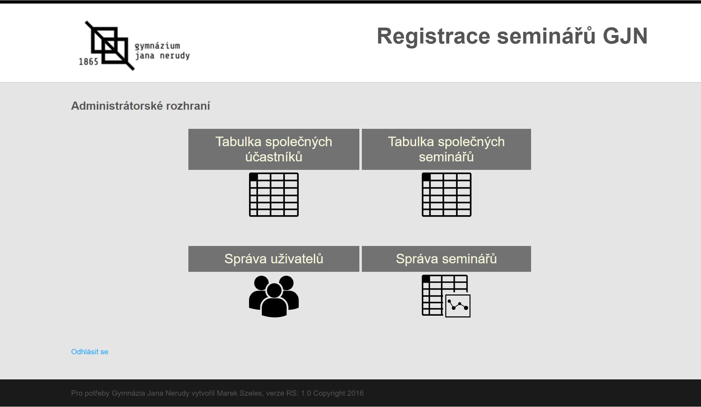

# GJN-Semináře
*(English below)*

## Popis
Základní program pro tvorbu rozvrhů na Gymnáziu Jana Nerudy (GJN). První verze byla dokončena na začátku roku 2015 ajkožto součást maturitní práce. Tento původní kód je také přiložen. Později ve stejném roce byl program rozšířen druhou verzí s vylepšenou grafikou a funkcionalitou v rámci semestrální práce v předmětu ZWA - Základy webových aplikací na ČVUT FEL. Jde tedy o můj první program, který byl využívaný a ačkoliv není příliš kvalitní, byla to dobrá a poučná zkušenost. Program byl dán škole plně k dispozici a v letech 2015-2021 bez nároku na odměnu pro školu hostován na následující webové adrese:
http://seminare-gjn.cz/

Aplikace má za cíl řešit problém vypisování volitelných seminářů pro studenty posledních ročníků GJN. Tento pro studenty příjemný prvek možnosti volby alespoň části svého rozvrhu ale představoval logistický oříšek, protože bylo třeba sledovat kapacitu jednotlivých kroužků a vypsat pouze ty, o který je zájem. Následně se tvořil rozvrh tak, aby se zvolené semináře překrývaly co nejmenšímu počtu studentů.

## Funkcionalita
Na základě požadavků gymnázia byla připravena specifikace funkcí, které měl projekt splnit - zejména jde o registraci a správu uživatelů, prevenci falešných účtů, přihlašování se na semináře a následné zobrazování rozdělení studentů mezi semináři. Bližší specifikaci lze najít v dokumentaci.

### Registrace a login
Na základě registrace uživateli přijde mail s výchozím heslem, které je nutné resetovat. Registrovat lze pouze emailové adresy předem zařazené/schválené administrátorem na tzv. "whitelist" (seznam povolených adres) ve správě uživatelů, což zabraňuje falešným účtům.

### Správa uživatelů
Zde lze vytvořit a mazat uživatele v systému, stejně tak jde také zobrazit semináře, na které je konkrétní uživatel přihlášený.

### Správa seminářů
Stejně jako u uživatelů jde i tady vytvářet a upravovat semináře. Navíc jde semináře deaktivovat, pokud by se na ně nepřihlásilo dostatek studentů, nebo by nastal jiný problém. Toto lze udělat i hromadně jedním kliknutím na základě zadaného minimálního počtu studentů pro jednotlivé semináře.

### Tabulka společných účastníků
Zde lze vidět, koik mají jednotlivé semináře společných účastníků a tedy podle toho navrhovat rozvrhy.

### Tabulka společných seminářů
V této tabulce je možné naopak nalézt počty společných seminářů pro studenty, a tedy zjistit, které případné překryvy seminářů by postihly nejvíce studentů a jsou tedy nežádnouci.

## Spuštění
Aplikaci lze spustit lokálně přes emulátor PHP serveru (například [WAMP](https://www.wampserver.com/en/)), případně aplikaci nahrát na libovolný server online - je nutné ale přenastavit konfiguraci databáze.

## Poděkování
Při tvorbě původní verze z roku 2014, tedy mého prvního pořádného programu, značně pomohl Ondřej Ježil: https://github.com/Punga3/
Styly byly inspirovány a částečně převzaty ze starého intranetu České středoškolské unie, který byl původně vyvinut Janem Papajanovským.

---------------
# GJN-Seminars
Basic schedule creating program for the Jan Nerude Grammar/High School in Prague. The first version was created early in 2015 and is thus the first program I ever created. The implementation is not by any means perfect, nor is it satisfactory by any means - but it worked and it was a good learning experience.

## Running the program
The app can be run either offline via a PHP server emulator ([WAMP](https://www.wampserver.com/en/) for example), or it can be uploaded to some online server instead - although it is important to reconfigure the database connection.

## Credits
While creating the first version in 2014 (which was my first ever programming project), I got substantial kind help from Ondřej Ježil: https://github.com/Punga3/
The CSS styles were inspired by and partially reused from the old intranet of Czech High School Students Union, which was created by Jan Papajanovský.
